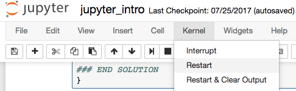

# Tips for BC2023 Bioinformatics Workshops

## General Advice

#### Create Test Cells

Create as many empty cells as you like to try out commands.  This will provide much better feedback on whether you are running the correct commands than entering things directly into an answer cell.  

-------

## Troubleshooting

#### Tests don't work. 

When you run tests you get a message such as "test_e4 command not found"

> You most likely need to rerun the setup code at the top of the notebook.  You will need to rerun the setup code whenever you restart your notebook kernel.

#### Example files are not in the right place.
		
>You are most likely in the wrong directory. All notebook exercises are designed to work without ever changing directories.  

**Solution:** restart your notebook kernel.

#### Notebook has locked up and won't run any more commands. 
	
>Your kernel might be waiting for input.  This can happen if you run certain commands (eg `grep`) without providing all the required inputs.  You can tell if your kernel is busy by looking at the kernel activity indicator

  

**Solution:** restart your notebook kernel.

