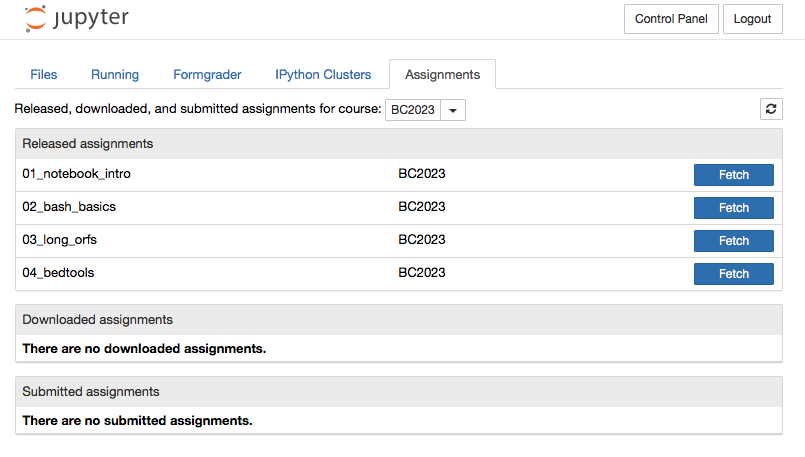

# Bioinformatics Tutorial Exercises

Developed by Ira Cooke for BC2023, James Cook University

This subject includes five bioinformatics tutorials designed to introduce some of the core skills required for manipulating large biological sequence datasets. The tutorials are based around the *central dogma* of biology and will demonstrate how in-silico translation of a genome sequence can be used to find and annotate genes.

All of the tutorials take the form of an interactive notebook which you can access using a web browser.  These notebooks include all of the instructions for completing each tutorial and include space for you to add your answers. For tutorials 1-4, self-assessment exercises are provided to help you track your progress.  **The final notebook (tutorial 5) must be submitted for assessment** and will be released for download prior to week 11 and will be due in week 12.

Most programs for analysis of large biological sequence datasets use a text based interface called the *command line*.  We will learn one of the most commonly used command line environments called *bash* [Bourne Again Shell](https://en.wikipedia.org/wiki/Bash_(Unix_shell)).  The best way to learn bash is to play around and type commands.  To help you do this we've built an [interactive website](http://bc2023.bioinformatics.guide/lessons/) that guides you through the most useful commands and gives you access to a bash shell where you can experiment with them.  You can access the website at [http://bc2023.bioinformatics.guide/lessons/](http://bc2023.bioinformatics.guide/lessons/). The website forms the *textbook* for these tutorials.

Workshop Date |  Workshop Theme  | Notebook  | Guide Chapters
-------- | -------------------- | ------------ | -------------
Week 3| Jupyter notebooks and Bash | `01_notebook_intro` | 0-13
Week 5| Command line basics | `02_bash_basics` | 14-22
Week 7| Translation | `03_long_orfs` | 0-22
Week 9| Genomic intervals | `04_bedtools` | 0-22
Week 11| Revision and Assessment | `05_assessment` | 0-22

Each workshop consists of an online tutorial and set of exercises. In order to get the most out of available help from tutors and instructors you should complete relevant chapters from the [interactive guide website](http://bc2023.bioinformatics.guide/lessons/) and make an attempt to complete the corresponding notebook prior to each workshop.

To access the assignments;

1. Use a web browser (eg Chrome, Safari, Firefox) to navigate [https://nb.bioinformatics.guide](https://nb.bioinformatics.guide)
2. Login using your jc number.  The password will not be your usual JCU password and will be provided to you via email.  See me if you did not get a password or if your login fails.
3. Click the `Assignments` tab (see screenshot below) to show a list of available assignments
4. Click `Fetch` to download the relevant assignment.

